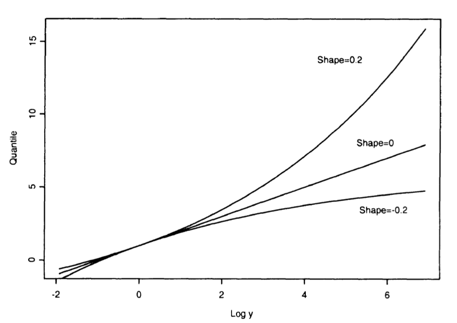

# Apéndice  {#sec:ap}

## Teorema Central del Límite {#sec:tcl}


```{theorem, label="tcl", name="Teorema Central del Límite"}

Siguiendo a @bertsekas2008introduction, sea $X_1,X_2, \dots$ con $i=1,\dots,n$, una secuencia de variables aleatorias $iid$ con media \( \mu \) y varianza \( \sigma^2 \) finita y definamos 

\begin{equation}
Z_n=\frac{X_1+\dots+ X_n-n\mu}{\sigma\sqrt{n}}
\end{equation}


Entonces, la función de distribución acumulada (CDF) de \( Z_n \) converge a la CDF normal estándar \( \Phi(z) \), es decir:
  
$$
\lim_{n \to \infty} \mathbb{P}(Z_n \leq z) = \Phi(z) = \frac{1}{\sqrt{2\pi}} \int_{-\infty}^z e^{-x^2/2} dx, \quad \text{para todo } z \in \mathbb{R}.
$$
```


__Importancia conceptual:__ El TCL nos dice que la suma de muchas variables aleatorias independientes es aproximadamente normal. Esto se observa en situaciones donde un efecto aleatorio es la suma de muchas influencias pequeñas e independientes. 

__Importancia práctica:__ El TCL permite aproximar distribuciones sin conocer los detalles exactos de las funciones de masa o densidad. Basta con conocer la media y la varianza, lo que facilita el uso de la tabla de la normal estándar para cálculos de probabilidades, estimaciones e inferencias estadísticas.

## Aproximaciones Basadas en el Teorema Central del Límite {.unlisted .unnumbered}

El **Teorema Central del Límite (TCL)** permite aproximar probabilidades asociadas a la suma de variables aleatorias independientes tratándolas como si siguieran una distribución normal. Dado que la normalidad se preserva bajo transformaciones lineales, esto equivale a considerar que \( S_n \) es una variable aleatoria normal con media \( n\mu \) y varianza \( n\sigma^2 \).

### Aproximación Normal Basada en el TCL

Sea \( S_n = X_1 + \dots + X_n \), donde las \( X_i \) son variables aleatorias independientes e idénticamente distribuidas con media \( \mu \) y varianza \( \sigma^2 \). Si \( n \) es grande, la probabilidad \( \mathbb{P}(S_n \leq c) \) puede aproximarse tratando a \( S_n \) como si siguiera una distribución normal, siguiendo el siguiente procedimiento:

1. Calcular la media \( n\mu \) y la varianza \( n\sigma^2 \) de \( S_n \).
2. Calcular el valor normalizado
   $$
   z = \frac{c - n\mu}{\sigma \sqrt{n}}.
   $$
3. Usar la aproximación
   $$
   \mathbb{P}(S_n \leq c) \approx \Phi(z),
   $$
   donde \( \Phi(z) \) es la función de distribución acumulada de la normal estándar, disponible en tablas estadísticas o mediante software.

 Esta aproximación es válida cuando \( n \) es suficientemente grande y se cumplen las condiciones del Teorema Central del Límite.


## Teorema de los tipos de extremales {#sec:teoext}

Las tres distribuciones de valores extremos son Gumbel, Frechet y Weibull, como se expresan en el siguiente Teorema \@ref(thm:thap1).


::: {.theorem #thap1 name="Teorema de los tipos de extremales"}
Si $\exists$ las secuencias de constantes $\left\{  a_n \right\}$ y $\left\{  b_n \right\}$ tal que 

$$
\Pr\{M^{\ast}_n \leq z\} \to G(z) \quad\text{a medida que}\quad n\to\infty
$$  
  
siendo $G$ una función de distribución no degenerada, entonces $G$ pertenece a una de las 3 siguientes familias:
  
\begin{align}
\begin{array}{rcl}
1)\;G(z) & = & \exp\left\{ -\exp\left[-\left( \frac{z-b}{a} \right)  \right] \right\}, \quad-\infty< z < \infty  \\
\\
2)\;G(z)& = & \left\{ \begin{array}{cl}
0 & ,\quad z\leq b\\
\exp\left\{ -\left( \frac{z-b}{a} \right)^{-\alpha} \right\} & , \quad z>b
\end{array} \right. \\
\\
3)\;G(z) & = &\left\{ \begin{array}{cl}
\exp\left\{ -\left[  -\left( \frac{z-b}{a} \right)^{\alpha}\right] \right\} & , \quad z< b \\
1 & , \quad z \geq b
\end{array} \right.
\end{array}
\end{align}
  
para parámetros $a>0$, $b$, y en los casos 2) y 3) para $\alpha >0$. $\square$
::: 

Cada familia tiene un parámetro de localización \( b \) y un parámetro de escala \( a \); además, las familias Fréchet y Weibull tienen un parámetro de forma \( \alpha \).

El Teorema \@ref(thm:thap1) establece que los máximos muestrales reescalados $\frac{M_n - b_n}{a_n}$
convergen en distribución hacia una variable cuya distribución pertenece a una de las tres familias mencionadas. Lo notable de este resultado es que los tres tipos de distribuciones extremales son los únicos límites posibles para las distribuciones de \( M_n \), independientemente de la distribución \( F \) de la población. En este sentido, el teorema proporciona un análogo del teorema central del límite para valores extremos. Es decir, no importa cuál sea la distribución original de los datos, cuando tomás muchos máximos muestrales ( valores máximos), y los reescalás de forma adecuada, su distribución siempre va a parecerse a una de tres formas posibles: Gumbel, Fréchet o Weibull [@coles2001introduction].

\clearpage

## Función de densidad (PDF) vs Función de distribución acumulada (CDF) {#sec:pdf}


\begin{table}[h!]
\centering
\caption{Comparación entre PDF y CDF}
\begin{tabularx}{\textwidth}{|l|X|X|}
\hline
\textbf{Concepto} & \textbf{PDF} & \textbf{CDF} \\
\hline
\textbf{Nombre técnico} & Probability Density Function & Cumulative Distribution Function \\
\hline
\textbf{Notación típica} & $f(x)$ & $F(x)$ \\
\hline
\textbf{Qué representa} & La \textit{intensidad} de probabilidad en un punto & La \textit{probabilidad acumulada} hasta un punto \\
\hline
\textbf{Propósito} & Describe cómo se concentra la probabilidad & Indica la probabilidad de que $X \le x$ \\
\hline
\textbf{Interpretación} & No es una probabilidad directa & Es una probabilidad \\
\hline
\textbf{Propiedades clave} & $f(x) \ge 0$, $\int_{-\infty}^{\infty} f(x)\,dx = 1$ & $F(x) = \int_{-\infty}^{x} f(t)\,dt$, creciente, $F(\infty)=1$ \\
\hline
\textbf{Usos comunes} & Visualizar dónde se concentran valores de $X$ & Calcular probabilidades y cuantiles \\
\hline
\end{tabularx}
\end{table}

## Familia de distribuciones generalizadas de valores extremos (GEV) {#sec:gev}

Las familias de Gumbel, Fréchet y Weibull pueden combinarse en una única familia de modelos con funciones de distribución de la forma

\begin{equation}
G\left( z \right)=\exp\left\{ -\left[ 1+\xi\left( \frac{z-\mu}{\beta} \right)^{-1/\xi} \right] \right\}
\end{equation}

definida en el conjunto $\left\{ z:1+\xi\left( z-\mu \right)/\beta>0 \right\}$ donde $-\infty<\mu<\infty$, $\beta>0$ y $-\infty<\xi<\infty$ son los parámetros de recentramiento, escala y forma, respectivamente.

Las clases de distribución de valores extremos de tipo 2) y tipo 3) corresponden, respectivamente, a los casos \( \xi > 0 \) y \( \xi < 0 \). El subconjunto de la familia GEV con \( \xi = 0 \) se interpreta como el límite de \@ref(eq:gev) cuando \( \xi \to 0 \), lo que conduce a la familia Gumbel, cuya función de distribución es:

\begin{equation}
G(z) = \exp\left\{ -\exp\left[ -\left( \frac{z - \mu}{\sigma} \right) \right] \right\}, \quad z \in \mathbb{R}
(\#eq:gev)
\end{equation}

La unificación de las tres familias clásicas de distribuciones extremales en una sola familia (GEV) simplifica el análisis estadístico. Al inferir el parámetro \( \xi \), los datos determinan el tipo de cola más adecuado, evitando decisiones subjetivas previas. La incertidumbre en \( \xi \) refleja cuán claro es ese comportamiento extremo en el conjunto de datos. Aunque los parámetros $a_n$ y $b_n$ son desconocidos, la distribución de los máximos puede aproximarse por una GEV [@coles2001introduction].


## Modelado práctico de extremos y niveles de retorno {#sec:practico}

A partir del Teorema de Fisher--Tippett--Gnedenko, se justifica el uso de la familia GEV para modelar los máximos de una secuencia larga de observaciones independientes. Como los parámetros de normalización \( a_n \) y \( b_n \) suelen ser desconocidos, una estrategia práctica consiste en dividir los datos en bloques de tamaño \( n \) (por ejemplo, un año), y considerar los máximos por bloque \( M_{n,1}, \dots, M_{n,m} \).

A esta nueva muestra de máximos por bloque se le ajusta una distribución GEV, y a partir de este modelo se estiman los \textbf{cuantiles extremos} (también llamados __niveles de retorno__). El cuantil \( z_p \) se define como el valor tal que

\[
\Pr(M_n > z_p) = p,
\]

es decir, el valor que se espera superar con probabilidad \( p \). A \( z_p \) se lo interpreta como el nivel de retorno asociado al período \( 1/p \). Por ejemplo, si \( p = 0.01 \), entonces \( z_p \) representa un evento que ocurre, en promedio, una vez cada 100 años.

Para visualizar esta relación, se grafican (Figura  \@ref(fig:gevparams)) los valores \( z_p \) contra \( \log Y_p \), donde \( Y_p = -\log(1 - p) \). El comportamiento de esta curva depende del parámetro de forma \( \xi \):


- Si \( \xi = 0 \) (Gumbel): el gráfico es lineal.
- Si \( \xi > 0 \) (Fréchet): el gráfico es cóncavo (cola pesada, sin límite superior).
- Si \( \xi < 0 \) (Weibull): el gráfico es convexo y tiene un límite superior finito.


```{r gevparams, fig.cap="Niveles de retorno de la distribución GEV con parámetros de forma" ,echo=FALSE, fig.height=3, fig.width=3, message=FALSE, warning=FALSE}

```


Este tipo de gráfico se conoce como _return level plot_, y es útil tanto para comunicar el modelo como para validar su ajuste [@coles2001introduction].

